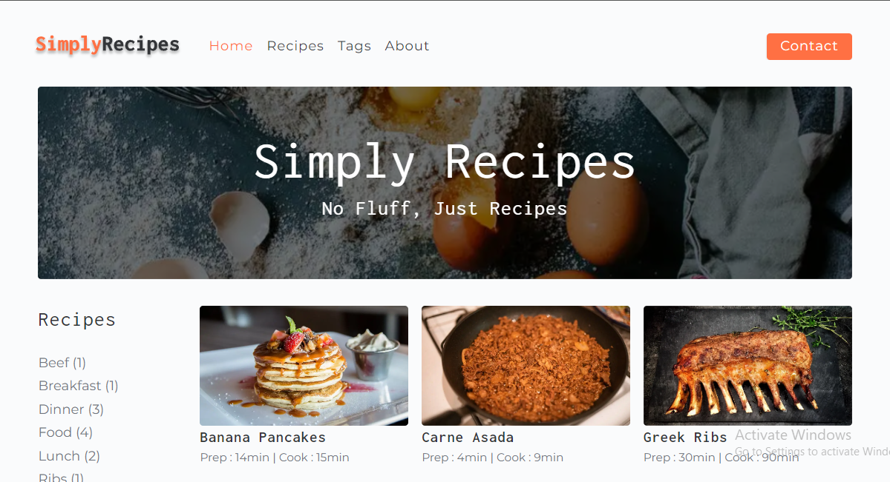

<!-- AUTO-GENERATED-CONTENT:START (STARTER) -->
<p align="center">
  <a href="https://www.gatsbyjs.com">
    
  </a>
</p>
<h1 align="center">
  Simply recipes site in Gatsby
</h1>

# Simply Recipes

Tags: App, Site, Tutorial Course

# Simply Recipes

### Recipes Web App in Gatsby

### Table of Content (Optional)

- [Description](#description)
- [Visuals](#visuals)
- [Technologies](#technologies)
- [Installation](#installation)
- [Usage](#usage)
- [Documentation](#documentation)
- [Roadmap](#roadmap)
- [Project Status](#project-status)
- [Credits](#credits)
- [License](#license)

### **Description (**Introduction - the project's aim) || Overview

This is “as the title suggest”, a simple recipe website for diffrent dishes, built with gatsby on the frontend and Contentful CMS. I allows me to upload my favorite dishes to the cloud with their recipes view them later.

It is a training project for me to learn practical usage of Gatsby.js, GraphQL and Content Management Systems. I sure did 🥳.

### **Visuals**



### **Technologies**

| Frontend | Backend |
| --- | --- |
| React.js | Contentful CMS |
| Gatsby,js | Node.js |
| Styled Components | GraphQL |

### **Installation** (Launch)

If you want to reproduce this project, you’ll need to have Node.js. See how to  install it [here](https://hardhat.org/tutorial/setting-up-the-environment.html).

You also need to have Gatsby.js installed in your computer

Clone this repo and in your terminal run:

```bash
npm install
```

Create an account with Contentful CMS and add your keys where applicable.

then run:

```bash
gatsby clean
npm start
```

You’re life on localhost:8000, and that’s it 🚀.

### Features (Scope of functionalities)

- View recipe list
- View Recipe

### ****Usage****

To view and use this project visit the deployed site [simply-recipees.netlify.app](https://simply-recipees.netlify.app) 

### **Contributing**

Yes, this is opensource. Fell free to make contributions.

### **Project status**

We’re done building.

### Sources

This Web App was a 9hr Gatsby Course tutorial by on freeCodeCamp

Contributors:

| Name | Role | Github |
| --- | --- | --- |
| Precious Nwaoha | It’s every part for now 🤘🏿 | https://github.com/preciousnwaoha  |
|  |  |  |

### **License**

MIT

<!-- AUTO-GENERATED-CONTENT:END -->
